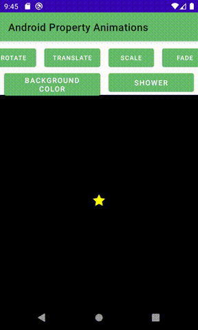

# Android Property Animations ⭐

Project created for the Udacity nanodegree Android Kotlin Developer program.

Animation is a powerful tool for helping users understand a potentially complex and confusing screenful of information. When a single item is updated, animating that change can help the user understand what happened.

## Key Features ✨

- ROTATE will cause the star to spin in a complete circle
- TRANSLATE will cause the star to move to the right and back
- SCALE will cause the start to scale up and then back down
- FADE will cause the star to fade out to completely transparent and then back to fully opaque
- BACKGROUND COLOR will cause the color of the star’s container to animate between black and red
- SHOWER will create a new star at the top of the starfield, which will then fall downwards while rotating. Every click will create a new star, animating in parallel with the existing stars

## Project Milestones

- What properties are and how to animate them
- How to use ObjectAnimator to animate UI elements
- How to configure ObjectAnimator for different UI animation situations
- How to use AnimatorSet to create a more complex animation of several parts
- How to use AnimatorListeners to set up initial and final state of objects that are being animated (such as removing views after fading them out)

## Overview

Android provides many facilities for animating UI objects.
This app shows how to create Property Animations, using ObjectAnimator, which are the basic building blocks of most Android animations. Property animations are used to animate (or change over time) the value of a property on an object, usually a UI object like an Android view.

In this app allows to animate stars on the screen by changing various View properties that control position, size, rotation, and translucency.

